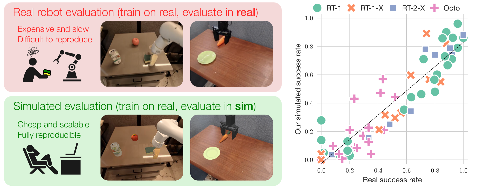

# SIMPLERENV Benchmark

[SIMPLERENV](https://github.com/simpler-env/SimplerEnv) is a benchmark for real-to-sim robot evaluation. 



## Environment Setup
We follow the [RoboVLMs](https://github.com/Robot-VLAs/RoboVLMs) repository for environment setup. This setup is only for evaluation. The following steps are required to set up the environment:

> Note: when use ray-tracing rendering, please make sure you have the nvoptix.so in /usr/share/nvidia

```shell
# Install dependencies
cd reference/RoboVLMs

# This will install the required environment
bash scripts/setup_simplerenv.sh

# Only for rendering environment.
bash scripts/setup_simplerenv_vla.sh

# Check if the environment is set up correctly
python eval/simplerenv/env_test.py
```

## Dataset Preparation
```shell
# 1. process the dataset (bridge & google)
python tools/process/simplerenv_bridge.py
    --dataset_dir /path/to/bridge_orig/1.0.0 \
    --output_dir /path/to/save/processed_data/bridge

python tools/process/simplerenv_google.py \
  --dataset_dir /path/to/fractal20220817_data \
  --output_dir /path/to/output/simplerenv_google

# 2. extract the vq tokens, need to change the dataset & output path
bash scripts/tokenizer/extract_vq_emu3.sh

# 3. pickle generation for training
python tools/pickle_gen/pickle_generation_simplerenv_bridge.py
```

## Model Training

### FAST Tokenizer
You can fit the FAST tokenizer on the corresponding dataset. Also, you can adjust the scale in tokenizer for more fine-grained tokenization.
```shell
python tools/action_tokenizer/fit_fast.py
```

```shell
bash scripts/simulator/simplerenv/train_simplerenv_bridge_video.sh
```

## Model Evaluation
```shell
cd reference/RoboVLMs

sh eval/simplerenv/bridge_univla.bash ${CKPT_PATH}

# get results, modify the results path
python eval/simplerenv/get_results.py
```

